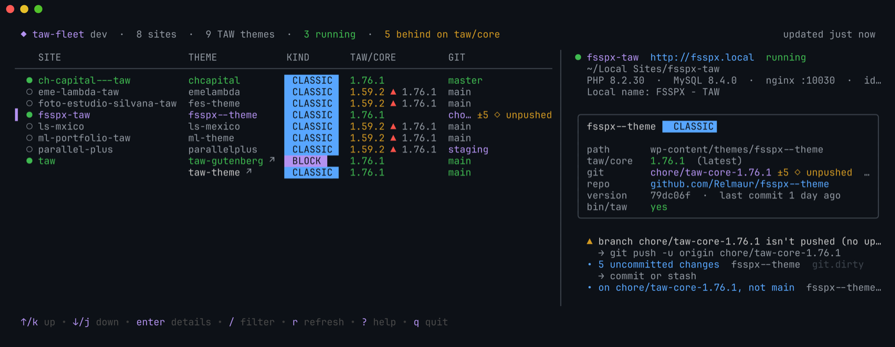

# taw-fleet

**Every TAW site on your Mac, in one terminal screen.**

`taw-fleet` finds the TAW themes in your Local by Flywheel sites without any setup. It shows each
one's status, taw/core version and git state, and opens the theme in your editor, the site in your
browser or the repo on GitHub.



> **v1.0.** Stable: the `--json` output and the `doctor` codes are a contract. Docs: the
> [taw-fleet page](https://github.com/Relmaur/taw-docs/blob/main/taw-fleet.mdx) in taw-docs.

## Install

On any Mac (Apple silicon or Intel):

```bash
brew install Relmaur/tap/taw-fleet     # update with: brew upgrade taw-fleet
```

Without Homebrew, download `taw-fleet_<version>_darwin_<arm64|amd64>.tar.gz` from the
[releases](https://github.com/Relmaur/taw-fleet/releases), put `taw-fleet` on your `PATH`
(e.g. `~/.local/bin`), and keep it current with `taw-fleet self-update`. With Go installed,
`go install github.com/Relmaur/taw-fleet/cmd/taw-fleet@latest` works too.

Then run `taw-fleet`. There is nothing to set up: it finds the sites from Local's own files.

`taw-fleet self-update` downloads the newest release for this Mac, checks it against the
release's `checksums.txt` and replaces the binary (`--check` only says whether there is one). It
leaves a Homebrew install to `brew upgrade`. The dashboard shows `▲ <version>` next to its own
version when a newer release is out.

## Use

Run `taw-fleet` on its own for the dashboard:

| Key | Does |
|---|---|
| `↑`/`↓` or `k`/`j`, `pgup`/`pgdn`, `home`/`end` | move |
| `enter` | the selected site in full (scroll with `↑`/`↓`, `esc` back) |
| `/` | filter by site, theme, branch or version, or by `behind`, `dirty`, `unpushed`, `running` |
| `e` `f` `t` | open the theme in your editor, in Finder, in a terminal |
| `b` `B` `P` | open the site, its wp-admin, its production site (when configured) |
| `g` `G` | open the theme's GitHub repository, its pull requests |
| `h` | hand the theme's update to an agent (see below); then `c` copies the prompt, `l` launches Claude Code |
| `s` `R` | start or stop the site, restart it (asks first; needs the Local app open) |
| `y` `S` | check the theme against the taw-theme scaffold (`bin/taw sync`); apply Tier 1 (asks first) |
| `u` | update taw/core (`composer update taw/core`, asks first), then list the UPGRADING.md sections to check |
| `o` | show the last sync/update/create output again (`esc` leaves a running one in the background) |
| `n` | create a new site (see below); when it's done, `c` copies the admin password |
| `r` | refresh now (it also refreshes every minute) |
| `?` | keys and symbols |
| `q` | quit |

At 120 columns and wider, the selected site's details sit beside the table. The colors follow
your terminal's light or dark background. When the output isn't a terminal (piped, CI),
`taw-fleet` prints the `list` table instead.

```bash
taw-fleet list            # every TAW site: status, themes, taw/core, git
taw-fleet show chcapital  # one site in detail (folder, name, domain, Local id or theme)
taw-fleet doctor          # what needs attention, most serious first, with the fix
taw-fleet doctor ls-mxico # the same for one site
taw-fleet list --all      # also sites and themes that aren't TAW
taw-fleet open <site>     # theme in your editor (see Shortcuts)
taw-fleet handoff <site>  # agent prompt for the theme's update (see below)
taw-fleet start <site>    # also stop, restart; and: taw-fleet wp <site> <wp-cli args>
taw-fleet sync <site>     # also update, inspect (see below)
taw-fleet version
```

Every read command takes `--json` (for scripts and Claude sessions) and `--offline` (don't ask
GitHub; use the cached newest versions).

```
 taw-fleet  ·  8 sites  ·  9 TAW themes  ·  3 running

    SITE                 THEME            KIND      TAW/CORE         GIT
 ●  ch-capital---taw     chcapital        CLASSIC   1.76.1           master
 ○  eme-lambda-taw       emelambda        CLASSIC   1.59.2 ▲ 1.76.1  main
 ●  fsspx-taw            fsspx--theme     CLASSIC   1.76.1           chore/taw-core-1.76.1 ±5 ◇ unpushed
 ○  parallel-plus        parallelplus     CLASSIC   1.59.2 ▲ 1.76.1  staging
 ●  taw                  taw-gutenberg ↗  BLOCK     1.76.1           main
                         taw-theme ↗      CLASSIC   1.76.1           main
```

### Start, stop and wp-cli

```bash
taw-fleet start ls-mxico          # asks first; --yes in scripts
taw-fleet stop fsspx              # also: restart
taw-fleet wp chcapital option get stylesheet
taw-fleet wp taw plugin list --format=json
```

Starting and stopping goes through the Local app's own API (Local must be open), and waits until
the site is up or down. `wp` picks the site's PHP, Local's wp-cli and the site's MySQL socket;
everything after the site goes to wp-cli, PHP notices go to stderr so `--format=json` stays
clean, and wp-cli's exit code is kept. While Local is open, statuses come live from it; the
active theme of each running site is read too (cached ten minutes) and marked ✓ when a site has
more than one TAW theme.

### Create a site

```bash
taw-fleet create                                   # asks everything in a form
taw-fleet create "Acme Shop" --block               # asks only what's missing
taw-fleet create "Acme Shop" --classic --php 8.2 --admin-user marco --admin-email me@example.com --yes
```

`create` (or `n` in the dashboard) makes a Local site and a fresh TAW theme in it:

1. Local creates the site through its own API (Local must be open) and starts it, with Local's
   preferred PHP and web server unless you pick versions Local has downloaded.
2. [taw-create](https://github.com/Relmaur/taw-create) installs **taw-theme** (classic) or
   **taw-gutenberg** (block) into `wp-content/themes/<name>` with the site's PHP and Local's
   Composer; the front-end assets are built (`npm`, when it's on your PATH).
3. wp-cli activates the theme, and the theme folder becomes a git repository with a first commit
   (connect GitHub when you're ready).

The WordPress admin password is generated and shown once at the end (`c` copies it in the
dashboard); taw-fleet never stores it. Folder, domain (`<name>.local`) and theme folder come
from the name; a name, domain or folder Local already has is refused before anything starts. If
a step fails, the message says what exists so far. Local's API can't delete sites: remove one in
Local's window.

### Sync, update, inspect

```bash
taw-fleet sync chcapital          # read-only: Tier 1 / Tier 2 differences from taw-theme, taw/core status
taw-fleet sync ls-mxico --apply   # write Tier 1 (asks first); Tier 2 is never written
taw-fleet update ls-mxico         # composer update taw/core (asks first), then the UPGRADING.md sections to work through
taw-fleet inspect chcapital       # blocks, fields and forms of a running site (bin/taw inspect)
```

These run the theme's own tools (`bin/taw`, from taw/core) with the site's PHP and Local's
Composer; progress streams to stderr, the summary goes to stdout (`sync --json` prints the raw
report). The dashboard's **SYNC** column shows the last check: `—` never run, `✓` framework files
match, `▲N` N Tier 1 paths differ, `✗` the check failed; `doctor` reports `scaffold.drift`.
Refused on the umbrella's own taw-theme/taw-gutenberg (they change through the taw-core release
flow); `sync` is for classic themes only. For the whole upgrade (branch, sync, Tier 2 review,
UPGRADING checks, commit), hand it to an agent instead: `taw-fleet handoff <site>`.

### Shortcuts

```bash
taw-fleet open chcapital              # the theme in your editor
taw-fleet open ls-mxico --github      # also --finder --terminal --browser --admin --prs --production
taw-fleet open taw --theme taw-gutenberg --terminal
```

Editors (Cursor, Visual Studio Code, PhpStorm, Zed, Sublime Text, Nova) and terminals (Ghostty,
iTerm2, Warp, kitty, Terminal) are found in `/Applications` and `~/Applications`; the first one
installed is used unless the config names another.

### Hand an update to an agent

```bash
taw-fleet handoff ls-mxico            # print the prompt
taw-fleet handoff ls-mxico --copy     # put it on the clipboard
taw-fleet handoff ls-mxico --launch   # a new terminal running Claude Code in the theme, with the prompt
```

The prompt asks the agent to run the theme's **update-theme** skill, with everything it needs to
know about this Mac: the theme, site and WordPress folders, the site URL and whether it's running,
the site's own PHP, Local's Composer, a wp-cli command with the site's MySQL socket, taw/core
installed vs newest, the git state and `doctor`'s findings. It also states the rules:

- work on `chore/taw-core-<version>` (or `chore/update-theme-<date>`), commit there, and **ask
  before pushing** or opening a PR;
- `composer update taw/core` is approved when the theme is behind, followed by every check in
  `vendor/taw/core/UPGRADING.md` newer than the installed version;
- Tier 2 files still need your OK, and uncommitted work or an unexpected branch means *stop and ask*;
- never touch `Blocks/`, `inc/`, templates, content, production or other sites.

The umbrella's own taw-theme and taw-gutenberg checkouts are refused: they're updated by the
taw-core release flow. `--launch` writes the prompt and a small launcher to
`~/Library/Caches/taw-fleet/handoff/` and opens your terminal with it (Warp can't run a script, so
Terminal is used instead).

### Settings

Optional, in `~/.config/taw-fleet/config.toml` (`taw-fleet config init` writes a commented
starter; `taw-fleet config show` shows what's in effect and which apps were found):

```toml
editor = "Cursor"        # or "code", "PhpStorm"…
terminal = "Ghostty"

[create]                 # defaults for taw-fleet create / n (all optional)
kind = "classic"         # or "block"
admin_user = "marco"
admin_email = "me@example.com"
php = "8.2.30"           # empty: Local's preferred
web_server = "nginx"

[sites.ls-mxico]         # keyed by the site's folder in ~/Local Sites
production_url = "https://lsmexico.mx"
notes = "Deploys from main."   # included in the handoff prompt
```

### What `doctor` checks

| Code | Severity | Means |
|---|---|---|
| `core.missing` / `core.unreadable` | error | no `vendor/` (run `composer install`), or `installed.json` is broken |
| `core.behind` | warning | taw/core is older than the newest release |
| `core.lock-mismatch` | warning | `vendor/` and `composer.lock` disagree |
| `git.no-upstream`, `git.behind`, `git.detached`, `git.no-remote` | warning | branch not pushed, commits to pull, not on a branch, no `origin` |
| `git.dirty`, `git.ahead`, `git.off-default`, `git.none` | note | uncommitted changes, commits to push, not on the default branch, not a repo |
| `theme.symlink-broken` | error | a symlinked theme points at a folder that's gone |
| `scaffold.behind` | note | an umbrella checkout of taw-theme/taw-gutenberg is behind its own release |
| `scaffold.drift`, `scaffold.check-failed` | note, warning | the last `sync` check found Tier 1 differences, or failed |
| `tools.php-missing` | warning | Local doesn't have the PHP build the site uses |
| `scan.local`, `scan.github`, `site.read-error` | warning | Local not found, newest versions unknown, a site couldn't be fully read |

The codes are stable: filter `doctor --json` on them. `doctor` only reads; it never changes
anything.

### Newest versions

The newest taw-core, taw-theme, taw-gutenberg and taw-fleet releases come from GitHub's tag list and are
cached for an hour in `~/Library/Caches/taw-fleet/github/`. Without a token GitHub allows 60
requests an hour, plenty with the cache. If `GITHUB_TOKEN`/`GH_TOKEN` is set, or the `gh` CLI is
signed in, that token is used (sent only to api.github.com). When GitHub can't be reached, the
last cached answer is used.

### How it finds sites

No setup. It reads Local by Flywheel's own files for the current user:

| What | Where |
|---|---|
| Sites | `~/Library/Application Support/Local/sites.json` |
| Running or halted | `…/Local/site-statuses.json` |
| Database socket | `…/Local/run/<site id>/mysql/mysqld.sock` |
| TAW themes | each `wp-content/themes/*/composer.json` that requires `taw/core` (symlinks followed) |
| taw/core installed / locked | the theme's `vendor/composer/installed.json` / `composer.lock` |
| Git state | `git` in the theme folder (read-only: no fetch, no locks) |

A theme's version is `git describe --tags`, never `style.css` (stale in every TAW theme). Client
themes forked from taw-theme inherit its old tags, so their describe is informational only.

A theme named `taw/gutenberg`, or a block theme (`wordpress-theme` with `theme.json` and
`templates/`), is **BLOCK**; any other TAW theme is **CLASSIC**.

### Environment

| Variable | Effect |
|---|---|
| `TAW_FLEET_HOME` | Use another home folder (e.g. a copy of `sites.json` for testing) |
| `TAW_FLEET_THEME` | `light` or `dark`: the color palette (default: from `COLORFGBG`, else dark) |
| `NO_COLOR` | No colors. Piped output and `--json` are never colored. |
| `GITHUB_TOKEN` / `GH_TOKEN` | Token for the newest-version lookup (else `gh auth token`, else none) |

## Develop

```bash
brew install go golangci-lint goreleaser
go test -race ./...
golangci-lint run
go run ./cmd/taw-fleet list
goreleaser release --snapshot --clean   # the release build, locally, into dist/
```

A `v*` tag runs `.github/workflows/release.yml`: GoReleaser builds both architectures, attaches
the archives and `checksums.txt` to the GitHub release and publishes the cask to
[Relmaur/homebrew-tap](https://github.com/Relmaur/homebrew-tap).

See [AGENTS.md](AGENTS.md) for the rules and
[ADR-0001](docs/adr/0001-go-tui-for-the-local-taw-fleet.md) for why it's built this way.
